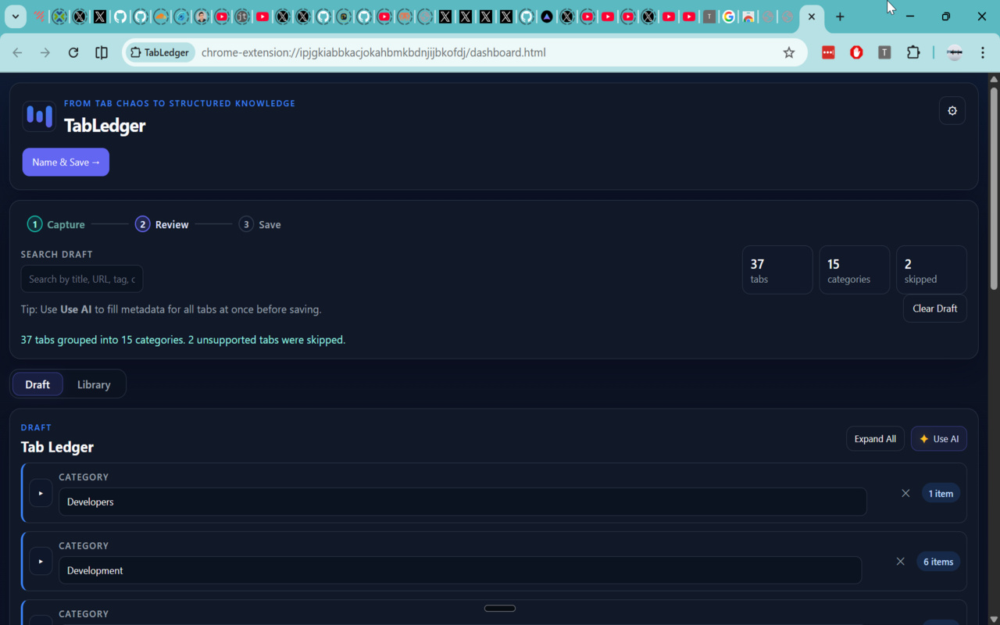
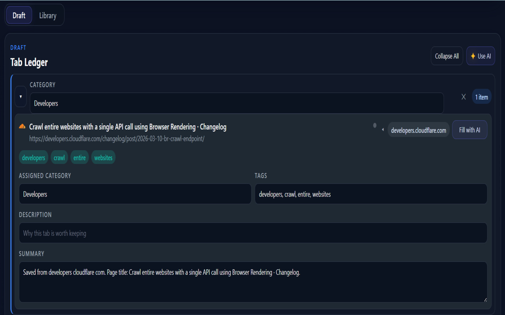
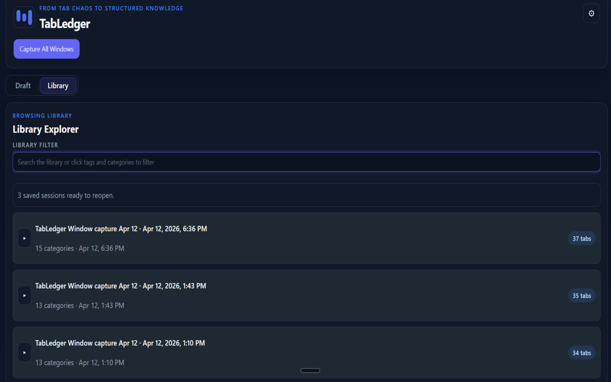
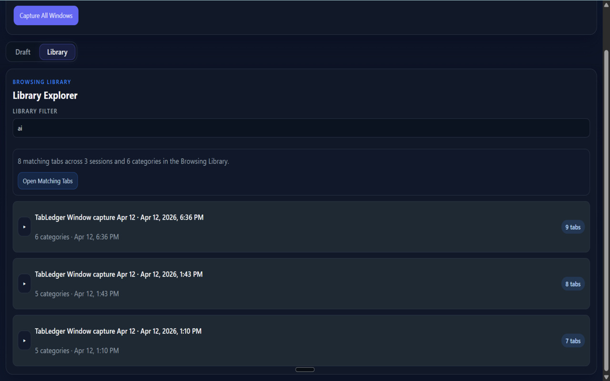

# TabLedger

> Capture every open tab, organize them with AI, and save structured sessions to your personal Browsing Library.

---

## What it does

- Captures tabs across all open browser windows in one click
- Guides you through a 3-step workflow: **Capture → Review → Save**
- Groups tabs into editable categories automatically
- Enriches each tab with AI-generated tags, description, and summary (optional — uses your own Gemini API key)
- Saves structured sessions into Chrome bookmarks + local extension storage
- Lets you search, filter, and reopen saved tabs from the built-in Library

---

## Workflow

### 1 — Capture

Click **Capture & Review** in the popup or **Capture All Windows** in the dashboard. TabLedger scans every open browser window, skips unsupported browser pages, and builds a draft workspace.

### 2 — Review

Tabs appear grouped by category. Click any row to expand its fields and edit `Category`, `Tags`, `Description`, or `Summary`.

- Use **Fill with AI** on a single tab or **Use AI** for the whole draft
- Rename a category by typing in the name field — **Save** confirms the rename, **Delete Category** removes that group from the draft
- **Expand All / Collapse All** to manage large sessions

### 3 — Save

Click **Name & Save →**, enter a session name, then **Save to Library →**. The newly saved session is highlighted in the Library.

---

## Browsing Library

Search and reopen any saved session at any time.

- Filter by title, URL, category, tag, description, or summary
- Open all matching tabs at once
- Edit or delete individual saved tabs
- Open it directly from the popup with **Open Library**
- Switch between **Draft** and **Library** from the workspace toggle at any point

---

## AI fill (optional)

AI runs only when you ask — it never runs automatically.

1. Open **Settings** (gear icon, top right) and paste your Gemini API key
2. Click **Fill with AI** on one tab or **Use AI** for the whole draft
3. TabLedger sends only the tab title, URL, and hostname to Gemini
4. Category, tags, description, and summary are filled in — your manual edits are never overwritten

The default model is `gemini-2.5-flash`. You can change it in Settings.

---

## Install

1. Clone or download this repo
2. Open `chrome://extensions`
3. Enable **Developer mode**
4. Click **Load unpacked** and select this folder

---

## Project files

| File | Purpose |
|---|---|
| `manifest.json` | Extension manifest |
| `popup.html` / `popup.js` | Popup launcher |
| `dashboard.html` / `dashboard.js` | Main workspace UI |
| `background.js` | Bookmark persistence and library operations |
| `styles.css` | All styles |
| `icon-*.png` | Extension icons (16, 32, 48, 128px) |

---

## Privacy

TabLedger has no servers and collects no data. Everything stays in your browser:

- Tab data → saved to your Chrome bookmarks and `chrome.storage.local`
- Settings → stored in `chrome.storage.local`
- AI fill → only tab title, URL, and hostname are sent directly from your browser to Google Gemini using **your own API key** — nothing goes to any TabLedger server

---

## Permissions

TabLedger requests the smallest set of Chrome permissions needed for its current feature set:

- `tabs` — required during capture to read each open tab's `url`, `title`, and `favIconUrl`, which TabLedger uses to build the draft, skip unsupported pages, group tabs, and show titles, links, summaries, tags, and favicons
- `bookmarks` — required to save sessions into the Browsing Library and manage saved entries
- `storage` — required to persist drafts, saved session metadata, and local settings

Without `tabs`, the capture flow cannot reliably build a full draft from all open windows because Chrome does not expose those sensitive tab fields to extensions by default.

---

## Tech

Vanilla JS · Chrome Extension Manifest V3 · Chrome Bookmarks API · `chrome.storage.local` · Gemini API (optional)
