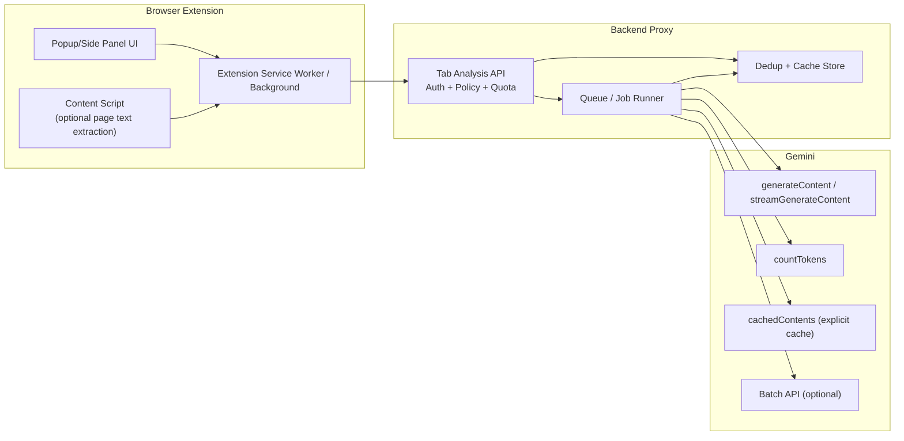
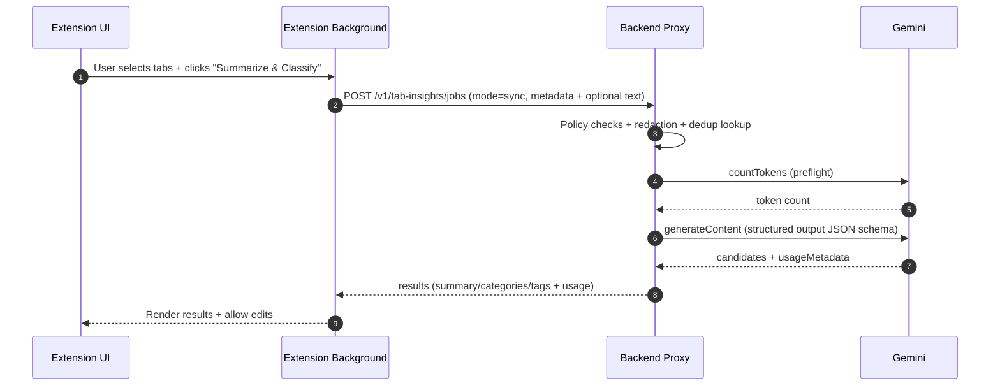

# Designing an API Pipeline for a Tab-Capture Browser Extension That Uses Gemini for Summarization and Classification

## Executive summary

This report defines a production-grade, security-forward API pipeline that connects a browser extension (capturing tab metadata and optional on-page text) to Gemini for **summarization, multi-label classification, tag suggestion, and category inference**. The core recommendation is a **three-tier architecture**: **extension → backend proxy → Gemini**, leveraging **structured outputs (JSON Schema)** to make results machine-safe and to reduce downstream parsing risk. citeturn11view2turn2view0turn17view0

Two official Gemini-access paths exist and materially affect auth, governance, compliance, and operational posture: the **Gemini Developer API** (fastest path, typically API-key-based) and **Gemini on Vertex AI** (enterprise controls, Google Cloud ecosystem). Both are reachable via the unified **Google Gen AI SDK**, enabling migration between the two without rewriting most code. citeturn18view0turn18view1turn17view1

For scale and cost control, the pipeline should implement **token-aware admission control** (preflight token counting), **deduplication** keyed by normalized URL + content hash, **caching** (implicit and explicit), and **tiered inference** strategy: Standard for interactive UX, Flex for latency-tolerant background enrichment, and Batch for large, non-urgent backfills at significant discounts. citeturn6view2turn15view1turn13view0turn14view5turn2view5

For browser-extension constraints, the design must respect extension **Content Security Policy**, content-script isolation, and robust messaging patterns between content scripts and the extension’s privileged contexts. citeturn19search0turn19search2turn19search3turn19search6

**Assumptions (explicitly stated because they determine architecture):**
- The extension captures at minimum: `url`, `title`, `favicon`, `tabGroupId` (if available), and optionally **page-extracted text** (readability-like extraction) only with user consent.  
- Workload varies from “few tabs, interactive” to “hundreds/thousands of tabs, background enrichment.”  
- No specific backend stack is assumed; examples use **JavaScript/TypeScript pseudocode** as requested.  
- A “safe-by-default” posture is required: do not ship long-lived API keys to clients; minimize data sent to model; provide opt-in controls for capturing sensitive URLs/content. citeturn17view0turn17view1turn19search0turn19search16

## Gemini SDK and API surface with official endpoints and auth patterns

### Official endpoints and methods you will actually use

At a practical level, tab summarization/classification pipelines rely on a small subset of official Gemini capabilities:

- **Content generation** via `generateContent` (single response) and optionally `streamGenerateContent` (SSE streaming for responsive UX). citeturn2view0turn3view0turn2view1  
- **Token counting** via `countTokens` for preflight sizing and throttling decisions (crucial for cost + rate-limit management). citeturn6view2turn5view1  
- **Structured outputs** (JSON Schema) to force schema-valid responses for classification/tags/metadata extraction. citeturn11view2turn3view2  
- **Context caching** (implicit and explicit) when repeated context is common, reducing cost and latency. citeturn15view1turn7view0  
- **Batch API / Flex / Priority service tiers** (when appropriate) to trade latency vs cost vs reliability. citeturn14view5turn13view0turn12view0

**Gemini Developer API (direct) endpoint shapes (official):**
- `POST https://generativelanguage.googleapis.com/v1beta/models/{model}:generateContent` citeturn3view0  
- `POST https://generativelanguage.googleapis.com/v1beta/models/{model}:countTokens` citeturn6view2  
- Batch enqueue: `POST https://generativelanguage.googleapis.com/v1beta/models/{model}:batchGenerateContent` (asynchronous job). citeturn14view5turn5view0  
- Explicit cache creation: `POST https://generativelanguage.googleapis.com/v1beta/cachedContents` citeturn7view0  

**Gemini on Vertex AI endpoint shape (official example shown for streaming):**
- Streaming: `POST https://aiplatform.googleapis.com/v1/{model}:streamGenerateContent` where `{model}` is a fully-qualified publisher model or endpoint name. citeturn2view3  
Vertex AI documentation also explicitly positions `generateContent` and `streamGenerateContent` as the primary content-generation methods for Gemini on Vertex AI. citeturn2view4

### Authentication patterns and recommended posture

**Gemini Developer API**
- The API reference explicitly documents API-key authentication through an `x-goog-api-key` header. citeturn2view0  
- OAuth is also supported; the official OAuth quickstart describes enabling the API, configuring the consent screen, and using application-default-credentials flows for testing vs production-hardening. citeturn2view6  

**Vertex AI**
- Vertex AI usage typically expects Google Cloud authentication; official guidance recommends **application default credentials** for production and API keys for testing-only contexts. citeturn2view8turn2view6  

**Unified SDK**
- Official docs state the Google Gen AI SDK provides a unified interface across the Gemini Developer API and Vertex AI, enabling migration between them with minimal code changes. citeturn18view0turn18view1  

**Non-negotiable production rule: do not embed long-lived API keys in the extension.**
- Google’s official “web apps” pathway explicitly says calling the Gemini API directly from a web client is for **prototyping**, and points to more secure production patterns (server-side use, or Firebase AI Logic for client SDK security features). citeturn17view0  
- The official JS SDK repo repeats the warning: avoid exposing API keys in client-side code; use server-side implementations in production. citeturn17view1turn2view7  

**Special case: ephemeral tokens**
- Gemini provides **ephemeral tokens** for Live API WebSocket usage, but the docs are explicit that **ephemeral tokens are only compatible with Live API** at this time (not the normal REST `generateContent`). So they are not a general solution for extension → REST inference. citeturn16view0  

## Recommended architecture, data flow, and API contracts

### Architecture overview

The architecture below assumes:
- The extension captures (a) tab metadata and (b) optionally, page text (content script extraction) only when the user opts in.
- The backend proxy owns model credentials, enforces quotas, performs redaction, de-duplicates work, and calls Gemini.


citeturn19search2turn19search3turn2view0turn6view2turn7view0turn14view5

### Why proxy is the default recommendation for extensions

A browser extension is a client application. Shipping static secrets in a client is a losing game: keys are extractable. Even if your extension is “not a website,” you still distribute code to adversaries. Official Google guidance explicitly frames direct client calls as prototyping only and recommends moving to server-side or secure client SDK patterns. citeturn17view0turn17view1

Additionally, extensions face hard security constraints:
- Extensions are subject to a default extension CSP that restricts script sources and disallows unsafe primitives like `eval()`. This affects bundling and runtime code generation choices. citeturn19search0turn19search4  
- Content scripts can read/modify page content but require host permissions and typically run in an isolated environment, requiring explicit messaging to privileged extension contexts. citeturn19search2turn19search6turn19search3

### API contract design: interactive vs background enrichment

You want **two pipeline modes**, because UX and economics compete:

- **Interactive mode** (“summarize these 5 tabs now”): synchronous response or streaming.
- **Background enrichment** (“process 300 tabs while I work”): asynchronous job, with queueing, backoff, and optional Flex/Batch.

A concrete, minimal contract set:

**1) Create job (async default; can request sync)**
- `POST /v1/tab-insights/jobs`

**Request (JSON)**
```json
{
  "mode": "sync|async",
  "tabs": [
    {
      "tabId": "string (extension local id)",
      "url": "https://…",
      "title": "…",
      "faviconUrl": "https://…/favicon.ico",
      "capturedAt": "RFC3339 timestamp",
      "source": {
        "tabGroupId": "optional string",
        "windowId": "optional string"
      },
      "content": {
        "text": "optional extracted text",
        "contentType": "text/plain",
        "extraction": "readability|selection|none"
      }
    }
  ],
  "tasks": {
    "summarize": true,
    "classify": true,
    "suggestTags": true
  },
  "output": {
    "schemaVersion": "2026-04-10",
    "maxSummaryChars": 600,
    "maxTags": 12
  }
}
```

**Response (sync)**
```json
{
  "jobId": "uuid",
  "status": "succeeded",
  "results": [
    {
      "url": "https://…",
      "summary": "…",
      "categories": ["Security", "DevOps"],
      "tags": ["oauth", "service-worker", "rate-limits"],
      "confidence": {
        "category": 0.86,
        "tags": 0.72
      },
      "usage": {
        "promptTokens": 1200,
        "outputTokens": 220,
        "totalTokens": 1420
      }
    }
  ]
}
```

**Response (async)**
```json
{
  "jobId": "uuid",
  "status": "queued",
  "pollAfterMs": 2000
}
```

**2) Poll job**
- `GET /v1/tab-insights/jobs/{jobId}` → `queued|running|succeeded|failed`

This aligns naturally with Gemini’s own Batch job lifecycle concepts (pending/running/succeeded/failed/cancelled/expired), even if you don’t use Gemini Batch internally at first. citeturn14view9turn14view5

### Sequence diagram for interactive mode


citeturn6view2turn2view0turn11view2turn4view0

### UI flow diagram for an end-to-end “captured tabs → insights” journey

```mermaid
flowchart TD
  A[User opens extension] --> B{Capture scope}
  B -->|Current window| C[Collect tab URLs/titles/favicons]
  B -->|Selected tabs| C
  C --> D{Include page text?}
  D -->|No| E[Send metadata only]
  D -->|Yes (opt-in)| F[Run content scripts to extract text]
  F --> E
  E --> G[Backend job: dedup, tokenize, classify, summarize]
  G --> H[Results displayed: categories, tags, summary]
  H --> I{User edits?}
  I -->|Yes| J[Apply edits + save]
  I -->|No| K[Export / create bookmarks]
```
citeturn19search2turn19search3turn11view2

## Prompt engineering and schemas for summarization, multi-label classification, and tag suggestion

### The critical design decision: enforce structured outputs

For this use case, “parse free-form text” is needless risk. Gemini supports structured outputs by setting `response_mime_type` to `application/json` and providing a JSON Schema; the docs emphasize that this yields syntactically valid JSON matching the schema, while still requiring application-level validation for semantic correctness. citeturn11view2turn11view3turn3view2

This maps directly to your needs:
- multi-label `categories[]`
- `tags[]`
- bounded-length `summary`
- optional `description`
- confidence scores and rationale fields (careful: rationale can leak sensitive content; use sparingly)

### Recommended response schema for tab insights

A practical schema should:
- constrain values (enums) where you can
- cap list lengths (tags/categories)
- bound summary size (by instruction + post-validation)
- include a `version` field so you can migrate

Conceptually:

- `categories`: multi-label array (allow unknown? or strict enum)
- `tags`: free strings but normalized server-side
- `summary`: short, consistent
- `signals`: optional fields derived from URL/title/text length (not “model thoughts”)

Gemini structured output mode supports key JSON Schema types and properties (including `enum` for classification tasks), but only a subset of JSON Schema is supported and overly complex schemas may be rejected. citeturn11view2turn11view5

### Prompt templates (table) with examples

The prompt design guide stresses clear, specific instructions, constraints, and iterative refinement; it also points out that structured output features are preferred over “prompting JSON by hand” for complex schemas. citeturn10view0turn11view2

Below are templates designed for a tab-capture product; each uses **(a)** a system instruction for consistent behavior and **(b)** a user prompt containing tab metadata and optional extracted text.

| Task | System instruction (template) | User content (template) | Output schema notes |
|---|---|---|---|
| Summarization | “You summarize web pages captured from browser tabs. Be concise, factual, and do not invent details not present in the inputs.” citeturn10view0 | Provide: `{url,title,optional extractedText}` and ask for a short summary with a max length constraint. citeturn10view0 | JSON: `{summary, keyPoints[]}`; cap `keyPoints` length. citeturn11view2 |
| Multi-label classification | “Given tab metadata, assign 1–3 categories from the allowed list. If unsure, pick the closest and lower confidence.” citeturn10view0 | Provide category enum list + tab fields. | Use `enum` for categories. Explicitly cap array length. citeturn11view2 |
| Tag suggestion | “Suggest 3–10 short tags (lowercase, hyphenated if needed). Prefer technical nouns and proper names from the tab.” citeturn10view0 | Provide tab inputs and ask for tags. | Validate tags server-side (length/charset). Structured outputs are syntactic; still validate semantics. citeturn11view3turn11view2 |
| Category inference (free taxonomy) | “Infer a category path (e.g., ‘Security > AppSec > OAuth’) based on the tab.” citeturn10view0 | Provide tab fields; ask for hierarchical categories. | Prefer fixed taxonomy if you need stable UX; otherwise dedupe/merge categories later. |

### Implementation pattern: one call vs multiple calls

You have two viable patterns:

**Pattern A: one-call “all outputs”**  
- Pros: fewer requests, lower overhead, consistent coupling between summary/tags/categories.  
- Cons: larger schema, higher chance of schema rejection if overcomplicated. citeturn11view5  

**Pattern B: staged calls (summarize → classify/tags)**  
- Pros: smaller schemas, easier debugging, better fallbacks (if summary fails, classification can still run). The prompt guide explicitly supports chaining prompts for complex workflows. citeturn10view0  
- Cons: more requests (impacts rate limits and cost).

For “bulk tab processing,” staged calls often win because you can:
- summarize only the subset that needs it
- classify on metadata-only for most pages (cheap)
- reserve full-text summarization for “high-value” pages

## Batching, rate limits, caching, retries, and cost-control strategies

### Rate limit realities you must design around

Gemini rate limits are enforced across multiple dimensions:
- **RPM** (requests/minute)
- **TPM** (tokens/minute)
- **RPD** (requests/day), resetting at **midnight Pacific time**  
Limits vary by model and tier; they are applied **per project**, not per API key. citeturn2view5

Batch calls have their own limits and operational constraints (e.g., concurrency and file limits) distinct from interactive traffic. citeturn2view5turn14view5

### Cost-control levers: Standard vs Flex vs Batch vs Priority

Gemini exposes multiple processing tiers with explicit tradeoffs:

- **Batch API**: asynchronous, designed for large volumes at **~50% of standard cost**, target turnaround **24 hours** (often faster), supports JSONL input, job polling, and can expire if pending/running too long. citeturn14view5turn14view9  
- **Flex inference**: synchronous but latency-tolerant, **50% cost reduction** vs standard, best-effort (“sheddable”), target minutes-scale latency; requires client-side retry/backoff and longer timeouts. citeturn13view0  
- **Priority inference**: premium tier for low latency and highest reliability, priced **~75–100% more** than standard; includes graceful downgrade behavior and requires monitoring for downgrade frequency. citeturn12view0  

A sane tab pipeline policy:
- Interactive “user waiting”: **Standard** (and optionally streaming)
- Batch enrichment overnight: **Batch API**
- Background enrichment when user not waiting but wants results soon: **Flex**
- Premium/paid tier feature: **Priority** (only if you can justify the cost)

### Token-aware admission control using countTokens + usageMetadata

**Before** you call `generateContent` on large extracted text, call `countTokens` to:
- estimate cost
- enforce per-user and per-org budgets
- decide between metadata-only classification vs full-text summarization. citeturn6view2turn10view0

After generation, record `usageMetadata` fields (prompt + candidate + total tokens; cached token counts when caching is involved) to drive billing and abuse detection. citeturn4view0turn15view1

### Caching and deduplication strategy

**Deduplication (your responsibility):**
- Normalize URL (strip common tracking params, remove fragment, canonicalize)
- Hash the “semantic payload” you sent to the model (title + extracted text hash)
- Use `(normalizedUrl, contentHash, modelId, schemaVersion)` as cache key
- Cache output JSON + token usage

**Gemini caching (model-side):**
- Gemini supports **implicit caching** (enabled by default on Gemini 2.5+ models, with no guaranteed savings) and **explicit caching** (guaranteed savings but requires developer work). citeturn15view1turn7view0  
- Explicit caches have a **TTL** (default 1 hour if not set in the guide) and billing depends on cached token count and storage duration. citeturn15view1turn15view7  

For a tab pipeline, explicit caching is most valuable when:
- you reuse a large shared prefix frequently (e.g., long system instruction, stable taxonomy list, repeated “scoring rubric”)
- you do “multi-question” analysis over the same page corpus (less common for tabs unless user iterates) citeturn15view6

### Retry/backoff and failure modes

You should treat the model call layer as a distributed system dependency:
- 429 (rate limit) and 503 (capacity) occur and must be handled. Flex explicitly calls out 503/429 behaviors and requires client-side retries/backoff; Priority and Batch have distinct operational semantics. citeturn13view0turn12view0turn14view9  
- Implement exponential backoff with jitter; cap retries; do not retry non-idempotent operations unless you have request IDs and dedupe.

Also: billing guidance states that if a request fails with a 400 or 500 error, you won’t be charged for tokens, but it can still count against quota—so failure still matters operationally. citeturn8view0

### Cost estimation model and throttling policies

**Gemini pricing is token-based** and (for caching) depends on cached tokens and storage duration. citeturn8view0turn9view0turn15view7

A robust cost model should compute per-request expected cost:

Let:
- `Tin` = input tokens (prompt)
- `Tout` = output tokens
- `Pin` = $/1M input tokens for chosen model/tier
- `Pout` = $/1M output tokens for chosen model/tier

Then:
- `cost ≈ (Tin / 1_000_000) * Pin + (Tout / 1_000_000) * Pout (+ caching storage if used)`

Use official pricing tables for the model/tier you select (standard vs batch vs flex vs priority). citeturn9view0turn14view5turn13view0turn12view0

**Throttling policy (recommended):**
- Per-user daily token budget + per-org monthly spend cap alarms.
- Hard cap on “max tabs per minute per user,” tuned to RPM/TPM constraints. (Gemini rate limits are per-project and multi-dimensional, so you need a combined limiter that tracks both RPM and estimated TPM.) citeturn2view5turn6view2  
- Adaptive downgrade:
  - full-text → metadata-only classification when token pressure is high
  - Standard → Flex for background jobs
  - Sync → Async job when queue depth rises

### Comparison tables

**Client-side vs server-side integration**

| Dimension | Client-side direct to Gemini | Extension → Backend proxy → Gemini (recommended) |
|---|---|---|
| API key security | High risk: secrets extractable; even official guidance frames as prototyping-only citeturn17view0turn17view1 | Keys stay server-side; rotate, scope, monitor |
| CORS / network controls | Must handle browser policies; still subject to web constraints citeturn19search16 | Server-to-server call avoids browser CORS complexity; extension only talks to your API |
| Privacy control | Hard to enforce org-wide data policy in many clients | Centralized redaction, logging controls, consent enforcement |
| Rate limiting | Distributed clients are hard to coordinate | Centralized quota + throttling + batching |
| Observability | Fragmented; harder to correlate | Centralized logs/metrics with privacy controls |
| Operational flexibility | Hard to switch models/tier quickly | Dynamic routing: Standard/Flex/Batch/Priority, and Developer API ↔ Vertex AI citeturn18view0turn12view0turn13view0turn14view5 |

**Batching strategies**

| Strategy | When to use | Pros | Cons | Official notes |
|---|---|---|---|---|
| Per-tab synchronous generateContent | Few tabs, interactive | Fast UX, simple | Expensive at scale; rate-limit pressure | `generateContent` is the core endpoint; streaming available citeturn2view0turn2view1 |
| Micro-batch (N tabs per request) | Medium batches | Reduces overhead; consistent taxonomy | Prompt gets large; harder to debug failures | Use `countTokens` to prevent oversize prompts citeturn6view2 |
| Flex tier enrichment | Background, minutes OK | 50% cheaper; still synchronous | Best-effort; may 503; requires longer timeouts + retries citeturn13view0 |
| Batch API (async) | Big backfills | 50% cost; high throughput | Async + polling; up to 24h target; job expiry possible citeturn14view5turn14view9 |

## Security, privacy, compliance, and observability for captured-tab AI

### Extension security realities you must respect

**Extension CSP is real and restrictive.**  
WebExtensions have an extension CSP by default that constrains script sources and disallows unsafe practices like `eval()`. Architect your build so you do not rely on runtime code generation or remote scripts. citeturn19search0turn19search4

**Content scripts are powerful and dangerous.**  
They run in the context of web pages and can read/modify page content, but require host permissions, and typically operate in an isolated environment relative to the page’s own JS context. This reinforces the need for explicit messaging and careful permissioning. citeturn19search2turn19search6turn19search3

### Permissioning and data minimization model

For tab summarization/classification, **data minimization** is your primary control:

- Default to **metadata-only** analysis (URL + title + optionally favicon/domain) unless the user explicitly opts in to include extracted text.
- For extracted text: strip:
  - query parameters likely to carry secrets (`token=`, `code=`, `session=`)
  - emails, obvious identifiers (configurable)
- Allow a user rule: “never send content from these domains / URL patterns.”

This approach reduces both privacy risk and token cost, and it aligns with the prompt guide’s advice to include only necessary context. citeturn10view0turn6view2turn8view0

### Logging and privacy-preserving observability

You need observability, but you must not turn logs into a shadow data lake of user browsing history.

Recommended telemetry to store server-side:
- hashed normalized URL (salted)
- model id + schema version
- token usage from `usageMetadata`
- latency, error codes, retry counts
- queue depth, job duration, batch/flex/standard selection
Gemini responses include `usageMetadata` explicitly for token accounting. citeturn4view0turn15view1

Gemini request structures also include knobs related to logging behavior (e.g., a `store` boolean described in the generateContent request fields); treat this as part of a data governance posture in combination with your account-level settings. citeturn3view4turn2view1

### Compliance posture (practical)

You should assume captured tabs can include:
- internal company URLs
- health/finance portals
- incident-response dashboards
- authentication flows (OAuth redirects with codes)

Therefore:
- enforce explicit consent for content capture
- encrypt in transit (TLS) and encrypt at rest for cached results
- implement retention limits (e.g., delete raw extracted text quickly; keep only derived summaries if user wants)
- provide export/delete controls

Billing and tiering details show that account-level configuration affects data handling and service behavior; plan governance centrally. citeturn8view0turn2view5turn18view0

## Implementation blueprint: contracts, pseudocode, and roadmap

### Key implementation snippets (JavaScript/TypeScript pseudocode)

#### Extension: collect tab payloads + send to backend

```ts
// Pseudocode: background/service worker context
async function buildTabPayloads(tabIds: number[], includeText: boolean) {
  const tabs = await browser.tabs.query({}); // filter to selected set in real implementation

  // Minimal metadata-only payload
  const payloads = tabs
    .filter(t => tabIds.includes(t.id!))
    .map(t => ({
      tabId: String(t.id),
      url: t.url,
      title: t.title,
      faviconUrl: t.favIconUrl,
      capturedAt: new Date().toISOString(),
      source: { tabGroupId: t.groupId ? String(t.groupId) : undefined },
      content: { extraction: "none" }
    }));

  if (!includeText) return payloads;

  // If includeText=true: ask content scripts to extract readable text.
  // (Content scripts require host permissions and must message back.)
  for (const p of payloads) {
    const text = await extractTextViaContentScript(p.tabId);
    p.content = { text, contentType: "text/plain", extraction: "readability" };
  }
  return payloads;
}

async function submitForInsights(tabPayloads: any[]) {
  const res = await fetch("https://api.yourdomain.example/v1/tab-insights/jobs", {
    method: "POST",
    headers: {
      "Content-Type": "application/json",
      "Authorization": `Bearer ${await getSessionToken()}`
    },
    body: JSON.stringify({
      mode: tabPayloads.length <= 5 ? "sync" : "async",
      tabs: tabPayloads,
      tasks: { summarize: true, classify: true, suggestTags: true },
      output: { schemaVersion: "2026-04-10", maxSummaryChars: 600, maxTags: 12 }
    })
  });

  return await res.json();
}
```
This design relies on the documented content-script model and runtime messaging to move page-derived data to privileged extension code. citeturn19search2turn19search3turn19search6

#### Backend: enforce policy, token preflight, structured output call

```ts
// Pseudocode: backend handler
async function createJob(req, res) {
  const user = await authenticate(req); // JWT/session
  const tabs = validateTabs(req.body.tabs);

  // Policy gates: domain denylist, opt-in required for text, size limits
  const sanitizedTabs = tabs.map(t => redact(t));

  // Dedupe check
  const dedupKey = computeDedupKey(sanitizedTabs);
  const cached = await cache.get(dedupKey);
  if (cached) return res.json({ jobId: cached.jobId, status: "succeeded", results: cached.results });

  // For sync: do work inline with strict time budget; else enqueue.
  if (req.body.mode === "sync" && sanitizedTabs.length <= 5) {
    const results = await runGeminiPipeline(user, sanitizedTabs);
    await cache.put(dedupKey, results);
    return res.json({ jobId: results.jobId, status: "succeeded", results: results.items });
  }

  const jobId = await queue.enqueue({ userId: user.id, tabs: sanitizedTabs });
  return res.json({ jobId, status: "queued", pollAfterMs: 2000 });
}

async function runGeminiPipeline(user, tabs) {
  // 1) Optional countTokens preflight (especially if text included)
  const tokenEstimate = await gemini.countTokens({
    model: chooseModel(user),
    contents: buildContents(tabs)
  });

  enforceBudgets(user, tokenEstimate.totalTokens);

  // 2) generateContent with structured outputs
  const response = await gemini.generateContent({
    model: chooseModel(user),
    contents: buildContents(tabs),
    config: {
      responseMimeType: "application/json",
      responseJsonSchema: tabInsightsSchemaJson,
      // optionally serviceTier: "standard" | "flex" | "priority"
    }
  });

  const usage = response.usageMetadata; // store for analytics and cost
  const parsed = JSON.parse(response.text);
  validateAgainstSchema(parsed);

  return { jobId: crypto.randomUUID(), items: parsed.items, usage };
}
```

This explicitly uses:
- `countTokens` endpoint for preflight token sizing citeturn6view2turn5view1  
- structured outputs config via `responseMimeType` + JSON Schema support citeturn11view2turn3view2  
- `usageMetadata` token accounting fields in responses citeturn4view0  

#### Batch mode (optional): enqueue JSONL input for large sets

```ts
// Pseudocode: backend batch submission for hundreds/thousands of tabs
async function enqueueBatch(tabRequests: GenerateContentRequest[]) {
  // Convert to JSONL and upload via Files API (not shown)
  const fileName = await uploadJsonlToGeminiFiles(tabRequests);

  // Create batch job
  const op = await gemini.batchGenerateContent({
    model: "gemini-3-flash-preview",
    batch: {
      displayName: `tab-enrichment-${Date.now()}`,
      inputConfig: { fileName }
    }
  });

  return op.name; // poll later
}
```

Batch API is officially positioned as asynchronous, discounted (~50% of standard), with polling states and JSONL-based large requests. citeturn14view5turn14view9turn5view0

### QA strategy and evaluation metrics

**Quality evaluation**
- **Classification accuracy**: micro/macro F1 on a labeled dataset of tabs; per-category confusion.  
- **Tag precision/recall**: compare to human tags; measure novelty vs noise rate.  
- **Summary utility**: human rubric (factuality, coverage, brevity, actionability).  
Structured outputs guarantee syntactic JSON, not semantic correctness—so you must validate and test business logic separately. citeturn11view3turn11view2

**Resilience/operations tests**
- Rate-limit simulation: enforce RPM/TPM/RPD policies; ensure backoff works and UI degrades gracefully. citeturn2view5turn13view0  
- Batch expiry handling: ensure your system survives `JOB_STATE_EXPIRED` and can split/retry. citeturn14view9turn14view0  
- Caching correctness: verify token-accounting and that cached-token counts appear in `usage_metadata` where expected. citeturn15view3turn4view0  

### Roadmap with milestones and effort estimates

| Milestone | Deliverable | Effort |
|---|---|---|
| Pipeline foundation | Backend proxy with `/jobs` API, auth, basic logging, Gemini `generateContent` call | Medium |
| Structured outputs | JSON Schema contract + parser/validator + schema versioning | Medium (risk: schema tuning) citeturn11view5 |
| Extension integration | Tab payload creation + messaging + opt-in content extraction UX | Medium–High (browser differences + CSP constraints) citeturn19search0turn19search2 |
| Rate limiting + budgets | Token preflight (`countTokens`), per-user/org throttles, graceful downgrade | Medium citeturn6view2turn2view5 |
| Caching + dedupe | URL normalization, hash-based cache keys, optional explicit caching | Medium citeturn15view1turn7view0 |
| Flex/Batch optimization | Flex tier for background; Batch API for bulk backfills | Medium citeturn13view0turn14view5 |
| Evaluation harness | Labeled dataset builder + regression tests + dashboards | High |
| Security hardening | Domain denylist, PII redaction, retention controls, incident playbooks | High |
| Observability | Metrics (latency, tokens, error rates), privacy-preserving logs | Medium citeturn4view0turn8view0 |

### Recommended libraries/frameworks (stack-agnostic)

- **Gemini integration**: official **Google Gen AI SDK** (`@google/genai`) for Node/TS, giving consistent access to both Developer API and Vertex AI (with security warnings about client-side keys). citeturn17view1turn18view0turn18view1  
- **Schema validation**: use a JSON Schema validator (or Zod → JSON Schema flow) consistent with structured output schema generation patterns shown in official docs. citeturn11view7  
- **Queues**: any durable queue (cloud-native or self-hosted) to implement async jobs and batch polling. (Gemini Batch itself is async and poll-based; your internal job model should mirror that.) citeturn14view9turn14view5  
- **Rate limiting**: token-bucket + concurrency controls keyed by user/org; must model both RPM and TPM. citeturn2view5turn6view2  

